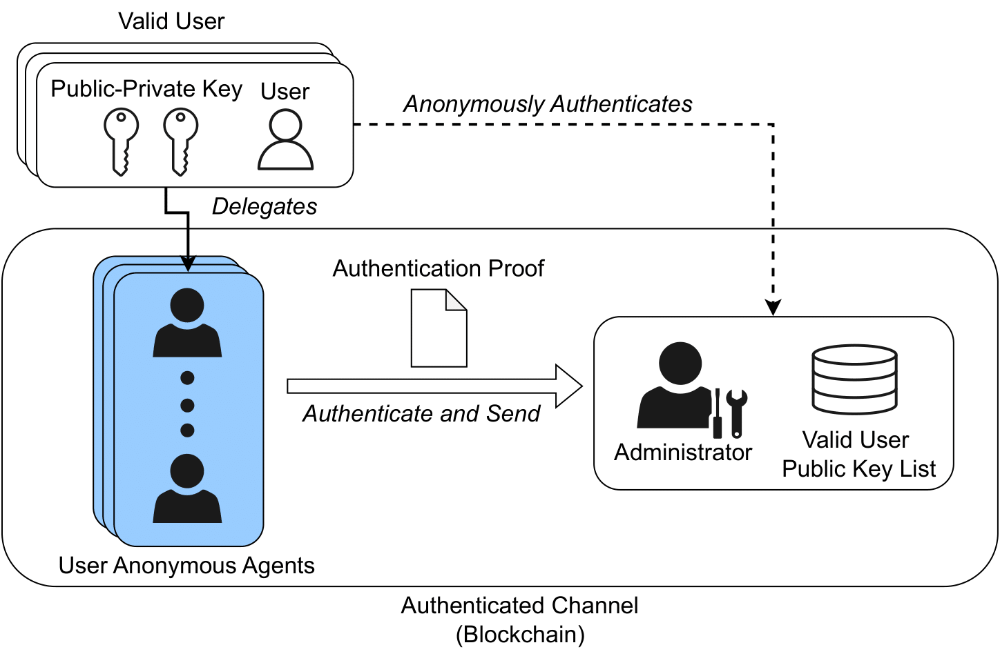
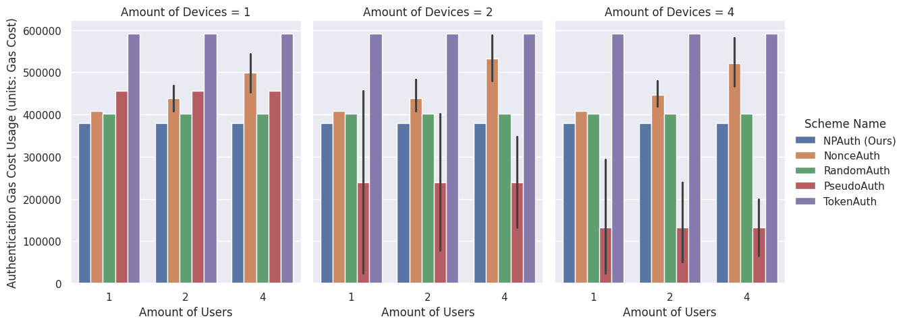
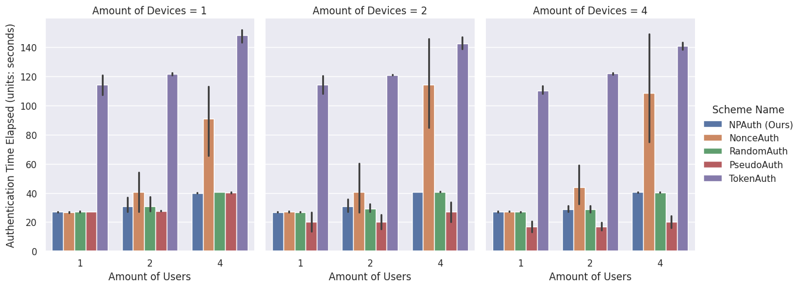

# Scalable Anonymous Authentication Scheme Based on Zero-Knowledge Set-Membership Proof

by Christopher Wiraatmaja, Shoji Kasahara.

This paper extends our previous [work](https://github.com/christopherwira/anon-auth-zkp-set-membership) and submitted at [***ACM: Distributed Ledger Technologies: Research and Practice***](https://dl.acm.org/journal/dlt).

DOI: WIP

>We proposed a novel delegation scheme, called zkNamedProof, which binds the authentication proof to a designated anonymous agent, preventing both privacy and security attacks. Using this technique, we developed a blockchain-based authentication scheme that is cost-efficient and responsive compared to prior works.

We provided our proposed anonymous authentication scheme as follows:



*Our Proposed Authentication Scheme*

Using our proposed technique, our scheme achieved cheaper expected gas cost and competitive time performance to access the devices without sacrificing security or privacy aspects, resulting in better overall scalability. Here are the results of our experiments:


*Gas Cost Comparison Table*


*Time Elapsed Comparison Table*

## Abstract

>In this paper, we propose zero-knowledge named proof, a stateless replay attack prevention strategy that ensures the user's anonymity against malicious administrators. We begin with adopting the zero-knowledge set-membership proof into an authentication setting in which users would delegate their requests to an agent that obstructs the user's identity from the administrator. This anonymous agent carries the guarantee of authenticity, which the administrator through the set-membership proof can confirm. Next, we prevent replay attacks from other parties by binding the agent's identity to the authentication proof verifiable by the administrators. By leveraging these properties, a scalable blockchain-based authentication scheme is then built. We quantitatively evaluate the security and measure the time and monetary cost of our scheme under both ideal and realistic environments. On top of it,  we provide a third-party authorization scheme derived from our authentication framework to demonstrate its real-world applicability.

## Experiment Implementation

> We utilized [ZoKrates](https://zokrates.github.io/) to implement our proposed technique and deploy the work in a private Ethereum node using [Hardhat](https://hardhat.org/).

### Requirements and Dependencies

Please clone this repository using your Git client by running

```
git clone https://github.com/christopherwira/scalable-anon-auth-zk-set-membership.git
```

Our implementation requires the following dependencies:
- Python `3.12` or newer
- ZoKrates `0.8.7` or newer
- Hardhat `2.20.1` or newer
- NodeJS `20.11.1` or newer

We recommend the user to utilize [**Anaconda**](https://www.anaconda.com/) to create the required environment.

After setting up the requirement, we can install the required Python packages using the following command

```
pip install -r requirements.txt
```

After ensuring all the previous dependencies is installed, we can continue to the next process.

### Running the Hardhat Node

We provide the required metadata to run the Hardhat node in the `hardhat` directory, which contains two sub-directories.

On the `hardhat_development` directory, run the following command
```
npx hardhat node --port 8545
```

On the `hardhat_production` directory, run the following command
```
npx hardhat node --port 8546
```

Make sure that the Ethereum node is running on both port `8545` and `8546`.

### Opening the Python Notebook

We provide the notebook used in our experiment in this repository. To open the notebook, it is required to run the Jupyter node using the command `jupyter lab`.
All the provided code should work if all the previous dependencies are installed correctly.

If there is a problem with the installation or dependencies, please feel free to submit an issue on this repository.

## License

All source code is made available under the terms of the [MIT license](LICENSE.md). 
